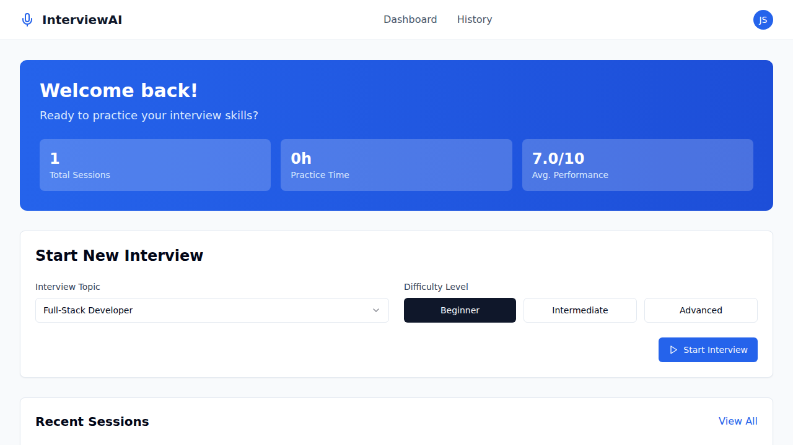
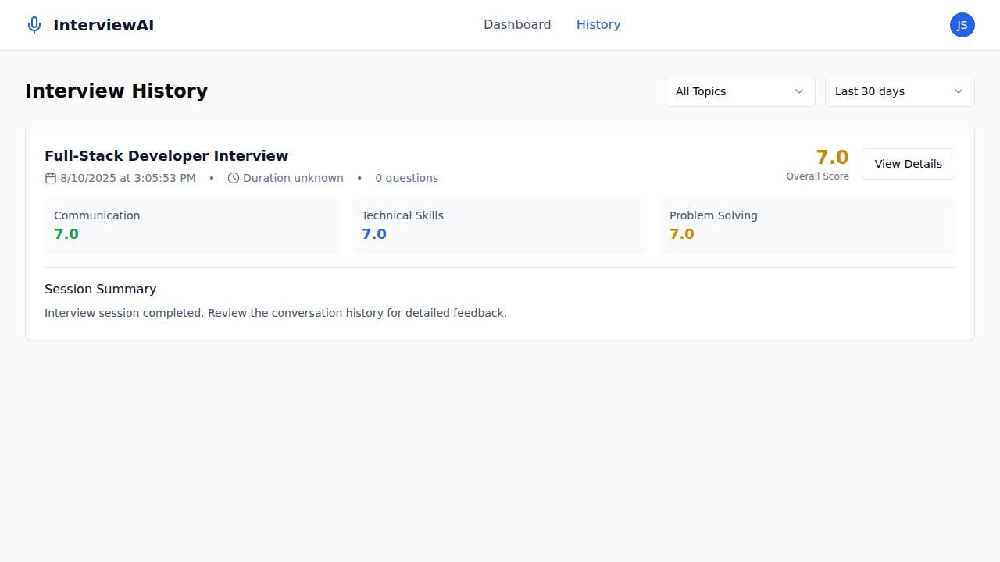
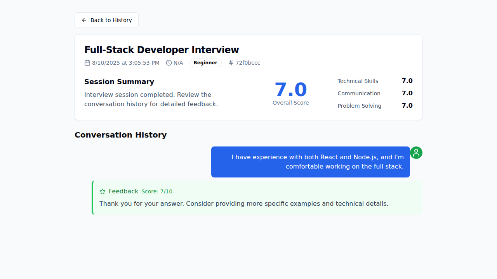

# InterviewAI: Your Personal AI-Powered Mock Interview Coach

<p align="center">
  
</p>

<p align="center">
  <strong>Practice your interviewing skills with a conversational AI that provides real-time feedback and performance analysis.</strong>
</p>

---

## About The Project

InterviewAI is a full-stack web application designed to help job seekers prepare for technical interviews. It simulates a real interview experience by having a conversation with an AI powered by Google's Gemini model. Users can choose an interview topic, answer questions using voice or text, and receive instant, detailed feedback on their responses. The platform tracks progress over time, providing a comprehensive history and performance analytics to help users identify their strengths and weaknesses.

This project was built to showcase a modern, end-to-end application using a popular and powerful tech stack, and to demonstrate the capabilities of conversational AI in a practical, helpful tool.

## Key Features

- **🤖 Conversational AI Interviews:** Engage in natural, back-and-forth interviews with an AI powered by Google Gemini.
- **🎙️ Dual Input Modes:** Choose between speaking your answers with real-time voice transcription or typing them out.
- **📈 Detailed Feedback & Scoring:** Receive a score from 1-10 and constructive feedback on every answer, helping you improve on the spot.
- **📊 Performance Analytics:** The dashboard and history pages provide an overview of your performance, including an overall score and a breakdown of communication, technical, and problem-solving skills.
- **📚 Session History:** Review your past interviews, including the full conversation transcript and all feedback, to track your progress.
- **✨ Modern & Responsive UI:** A clean and intuitive interface built with Tailwind CSS and shadcn/ui.

## Tech Stack

| Category | Technology |
|---|---|
| **Frontend** | React, TypeScript, Vite, Tailwind CSS, shadcn/ui, TanStack Query |
| **Backend** | Node.js, Express, TypeScript |
| **Database** | PostgreSQL with Neon (Serverless) |
| **AI** | Google Gemini 2.5 Flash |
| **ORM** | Drizzle ORM |

## Getting Started

Follow these steps to get a local copy up and running.

### Prerequisites

- Node.js (v18 or newer)
- A free PostgreSQL database from [Neon](https://neon.tech)
- A free API key from [Google AI Studio](https://makersuite.google.com/app/apikey)

### Installation & Setup

1.  **Clone the repository:**
    ```sh
    git clone https://github.com/yourusername/mock-interview-ai.git
    cd mock-interview-ai
    ```

2.  **Install dependencies:**
    ```sh
    npm install
    ```

3.  **Set up environment variables:**
    Create a `.env` file in the root directory and add your database connection string and API key.
    ```env
    # .env
    DATABASE_URL="your_postgresql_connection_string_from_neon"
    GEMINI_API_KEY="your_gemini_api_key"
    NODE_ENV=development
    ```

4.  **Push the database schema:**
    This command will set up the necessary tables in your database.
    ```sh
    npm run db:push
    ```

5.  **Run the development server:**
    ```sh
    npm run dev
    ```
    The application will be available at `http://localhost:5000`.

## Deployment

This project is configured for easy deployment on Vercel.

[](https://vercel.com/new/clone?repository-url=https%3A%2F%2Fgithub.com%2Fyourusername%2Fmock-interview-ai&env=DATABASE_URL,GEMINI_API_KEY)

### Vercel Deployment Steps

1.  **Click the "Deploy with Vercel" button above.**
2.  **Clone the repository** to your GitHub account.
3.  **Set Environment Variables:** Vercel will prompt you to enter the `DATABASE_URL` and `GEMINI_API_KEY`. Make sure to set these up as secret environment variables.
4.  **Deploy:** Vercel will automatically build and deploy the application. The `vercel.json` file in the repository contains the necessary configuration.

Your application will be live in a few moments!

## Project Showcase

### Interview History


### Detailed Session Review


## Available Scripts

- `npm run dev`: Starts the development server with hot-reloading.
- `npm run build`: Builds the application for production.
- `npm run start`: Starts the production server.
- `npm run db:push`: Pushes schema changes to the database.

## Contributing

Contributions are welcome! Please feel free to fork the repository, create a feature branch, and open a pull request.

1.  Fork the Project
2.  Create your Feature Branch (`git checkout -b feature/AmazingFeature`)
3.  Commit your Changes (`git commit -m 'Add some AmazingFeature'`)
4.  Push to the Branch (`git push origin feature/AmazingFeature`)
5.  Open a Pull Request

## License

Distributed under the MIT License. See `LICENSE` for more information.

## Acknowledgments
- [Google Gemini AI](https://ai.google.dev/)
- [Neon](https://neon.tech/)
- [shadcn/ui](https://ui.shadcn.com/)
- [Drizzle ORM](https://orm.drizzle.team/)
